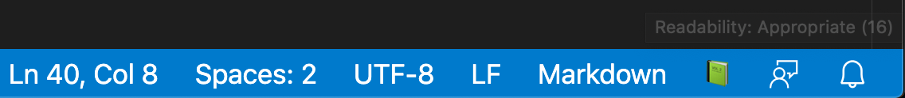

# docs-readability

> Visual Studio Code extension which indicates reading complexity of markdown documentation

## Usage

When a markdown document is opened or edited, the readable content is extracted and reading complexity is measured. The score represents a school reading grade, but extends beyond school ages. For instance a score of 9 is a reading age of 14 - 15.

The resulting score leads to one of five categorizations: 

* Elementary: 0 - 11
* Appropriate: 12 - 16
* Challenging: 17 - 21
* Esoteric: 21 - 26
* Baffling: 27+

Each categorization is represented by a book emoji in the status bar:

* Elementary: 📘
* Appropriate: 📗
* Challenging: 📙
* Esoteric: 📕
* Baffling: 📚

A tooltip is displayed when hovering over the emoji which displays the categorization
and score.

Note the score given is a loose guide and could use further refinement and analysis in its application to technical documentation.

## Example



This is the docs-readability status bar emoji for this document.

The readability rating of this readme is Appropriate, with a score of 16. 

## Tests

```sh
npm test
```

## Licence 

ISC

